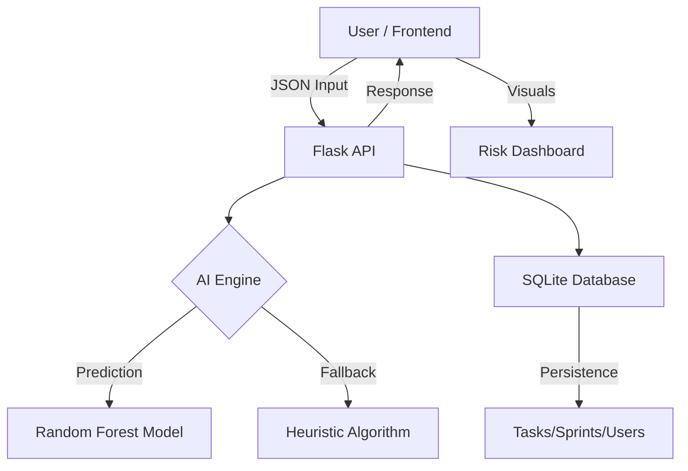

# 🚀 Virtual Decision System: Implementation Documentation

## 1. Project Overview
The **Virtual Decision System (Decision Advisor)** is an AI-powered project management platform. It uses machine learning to predict project delivery risks and provides data-driven recommendations to optimize timelines and resource allocation.

---

## 2. Technical Stack

| Layer | Technology | Description |
| :--- | :--- | :--- |
| **Frontend** | **React 18 + Vite** | High-performance UI with custom glassmorphism styling. |
| **Backend** | **Python 3.10+ (Flask)** | REST API server for logic and AI integration. |
| **AI/ML** | **Scikit-learn** | Random Forest Classifier for predictive analysis. |
| **Data** | **Pandas / NumPy** | Data processing and feature engineering. |
| **Database** | **SQLite** | Local relational database for task and user persistence. |

---

## 3. System Architecture



---

## 4. AI & Machine Learning Details

### Model: Random Forest Classifier
*   **Purpose**: Predicts the probability of a project delay (Low, Medium, or High risk).
*   **Features Used**:
    *   `team_size`: Number of developers.
    *   `project_complexity`: Scale of 1-10.
    *   `estimated_days`: Initial timeline.
    *   `budget`: Allocated financial resources.
    *   `task_count`: Total work items.

### The Logic "Pin-to-Pin"
1.  **Data Cleaning**: Handles missing values and normalizes project inputs.
2.  **Labeling**: Automatically categorizes historical data based on `actual_days` vs `estimated_days`.
3.  **Training**: Random Forest builds multiple decision trees and merges their results for high accuracy.
4.  **Simulation**: The backend iterates through different "what-if" scenarios (e.g., adding 2 developers) and re-runs the model to find the option with the lowest risk.

---

## 5. Implementation Roadmap

### Phase 1: Interactive Frontend
Developed using React with a modular component architecture.
- `App.jsx`: Main routing and dashboard state.
- `components/`: UI elements like `TaskCard`, `RiskMeter`, and `SimulationPanel`.

### Phase 2: Flask API & Integration
- `app.py`: Defines REST endpoints for `/analyze`, `/tasks`, and `/pm/stats`.
- `CORS`: Configured to allow seamless frontend-backend communication.

### Phase 3: AI Persistence
- `risk_model.joblib`: The binary file where the "intelligence" of the system is stored.
- `ml_model.py`: The logic for both training (with new CSV data) and real-time prediction.

---

## 6. How to Run Locally

### 1. Backend
```bash
cd backend
python -m venv venv
# Windows
venv\Scripts\activate
# Linux/Mac
source venv/bin/activate

pip install -r requirements.txt
python app.py
```

### 2. Frontend
```bash
cd frontend
npm install
npm run dev
```

---

## 7. Future Improvements
*   **Deep Learning (TensorFlow)**: Integrating neural networks for more complex pattern recognition.
*   **Real-time Notifications**: WebSockets for live risk updates as tasks are moved.
*   **Multi-User Auth**: Advanced JWT-based authentication for team roles.
